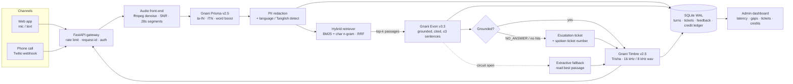

# Kural architecture

## Request lifecycle (voice)

| # | Step | Code | Notes |
|---|---|---|---|
| 1 | Upload / phone recording | `api/routes.py`, `telephony/twilio.py` | 10 MB / 120 s limits; per-IP token bucket |
| 2 | Decode + clean | `audio.normalize` | `highpass 80 Hz → lowpass 7.5 kHz → afftdn → dynaudnorm → 16 kHz mono` |
| 3 | Quality metrics | `audio.analyze` | 10th/90th percentile frame energy gives an SNR estimate; flags noisy calls |
| 4 | Segment | `audio.segment` | Cuts at the quietest 20 ms frame within the last 8 s of each 28 s window, so words aren't split |
| 5 | STT | `gnani/stt.py` | Segments run concurrently; `format=transcribe` (ITN); KB aliases go into `bias_list` |
| 6 | Redact + detect | `core/security.redact`, `lang.detect` | Script ratios plus a romanised-Tamil lexicon decide reply language and code-mix style |
| 7 | Retrieve | `rag/store.py` | Short follow-ups get the previous question added for context; cosine gate rejects off-topic |
| 8 | Generate | `gnani/evon.py`, `prompts.py` | Strict grounding rules, `NO_ANSWER` sentinel, `<think>` traces stripped |
| 9 | Guardrails | `pipeline.py` | Citations validated against hit count; markdown and citations removed before speech |
| 10 | Speak | `gnani/tts.py` | Content-hash disk cache; phone profile 8 kHz WAV for `<Play>` |
| 11 | Persist | `core/db.py` | Per-stage timings, SNR, confidence, fallback flag, ticket |

## Reliability

- **Retries:** exponential backoff with jitter on 429/500/502/503/504 and transport errors, honouring `Retry-After`. 4xx errors are never retried.
- **Circuit breakers** per upstream (Prisma, Timbre, Evon): after N failures they fail fast for a cooldown, then let one trial request through.
- **Degradation ladder:** Evon down → extractive answer. Timbre down → text answer (phone channel uses `<Say>`). Prisma down → clean error and the caller is prompted again.
- **Readiness** (`/readyz`) treats Evon as optional (degraded), but the knowledge base, API key and credits as required.

## Security and privacy

- PII patterns (Aadhaar, PAN, Indian mobile, 11–18 digit account numbers, email) are replaced with `[LABEL]` tokens before storage, logging or the LLM sees them.
- Caller phone numbers are stored only as salted SHA-256 prefixes.
- Twilio `X-Twilio-Signature` HMAC-SHA1 check when `TWILIO_AUTH_TOKEN` is set.
- Admin endpoints use a constant-time key compare. In prod, the app refuses to boot with the default key.
- Security headers on every response; CORS allow-list is configurable; the container runs as a non-root user.

## Scaling notes

- The service is stateless apart from SQLite and the in-memory reply-audio LRU. For more than one replica, move the DB to Postgres (schema is plain SQL) and serve reply audio from object storage. The TTS cache directory can be a shared volume.
- Retrieval runs in-process on numpy and handles thousands of chunks in milliseconds. Past ~100k chunks, swap `HybridIndex` for a vector store; the `search()` interface stays the same.
- For latency under a second on calls, the next step is Prisma's realtime WebSocket (`wss://api.vachana.ai/stt/v3/stream`) and Timbre SSE streaming. The clients are isolated, so this is a drop-in change.
